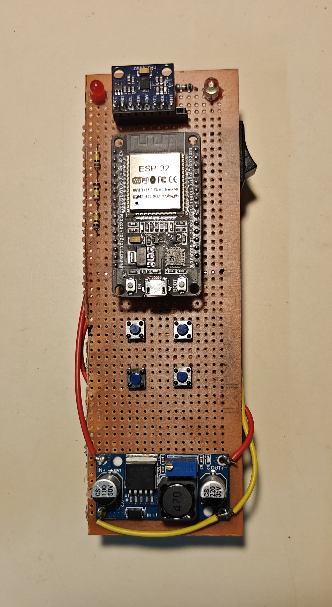
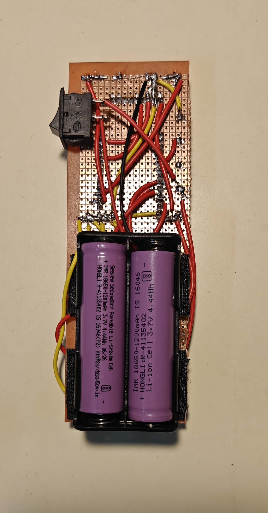
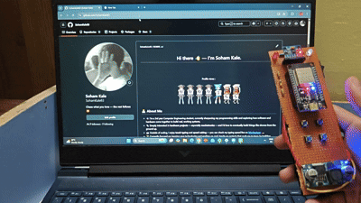

# 🖱️ AeroTrack-ESP32: Wireless Air Mouse

ESP32 Air Pointer is a high-precision, plug-and-play Bluetooth LE air mouse that transforms hand gestures into smooth on-screen cursor movements. By combining an ESP32 and MPU6050/6500 IMU, it uses custom exponential smoothing and strict deadzones to completely eliminate hand tremors and drift. 

It acts as a native HID device featuring tactical click switches, fluid webpage scrolling controls, and a dedicated low-battery alert circuit—making it a seamless controller for laptops, smartphones, and smart TVs with zero cursor lag.

---

## ✨ Features
* **Tremor-Free Fluid Tracking:** Utilizes custom exponential smoothing and expanded signal deadzones to deliver stable pointer motion without hand jitters
* **Plug-and-Play BLE Connectivity:** Emulates a native Bluetooth HID mouse that connects instantly to Windows, Android, macOS, and Linux without external software.
* **Dedicated Web Scroll Mechanics:** Integrates continuous vertical page scrolling directly onto hardware tactile pushbuttons for seamless browsing.
* **Instant-On Drift Calibration:** Implements hardcoded raw bias offsets to eliminate the need for lengthy startup delay configurations or resting states.
* **Smart Background Battery Monitor:** Tracks dual-cell logic voltage dividers via non-blocking timers to activate low-power alert LEDs without introducing cursor lag.

---

## 🛠️ Hardware Requirements

|Sr no. | Componets | Quantity | Description |
|---|---|---|---|
| 1 | ESP32 | 1 | Brain of cursor working | 
| 2 | Pushbutton | 4 | For clicks | 
| 3 | Female pin headers | 2 | To place microcontroller and mpu6050 |
| 4 | Lm2596 buck converter | 1 | For power supply 5v | 
| 5 | white (5mm) led | 1 | To indicate that esp32 and mpu6050 is working | 
| 6 | red (5mm) led | 1 | If battery voltage low it will light up  | 
| 7 | Switch | 1 | To turn ON or OFF | 
| 8 | 2x lithium battery holder | 1 | To place 2 lithium ion batteries |
| 9 | Perfboard | 1 | Sensors and microcontroller and other things will be placed on this |
---


## 📸 Hardware photos

| Front | Back |
|:---:|:---:|
|  |  | 

---

## 🎬 Working Demo 



---

## 🔌 Wiring / Connections

Schematics
|:---:|
||


---

## 🛠️ Guide to Build It

Follow these steps to assemble the hardware and flash the software for your custom Air Mouse.

### 1. Hardware Assembly & Connections
Before wiring the components, check out the wiring schematic image/diagram file included directly inside this repository. 

Key physical rules to keep in mind during assembly:
* **Power Supply:** Connect the IMU's `VCC` pin directly to the ESP32's **3.3V (3V3) pin**. Avoid the 5V line to prevent logic level mismatches that can freeze the I2C communication bus.
* **No External Resistors:** You do not need external pull-up resistors for the tactile push buttons. The internal `INPUT_PULLUP` resistors on the ESP32 pins are enabled automatically by the firmware code.
* **Shared Grounds:** Ensure all component ground points (the IMU and both click buttons) are tied together back to a common **GND** pin on the ESP32 dev board.
* **Address Pin:** Tie the **AD0** pin on your IMU sensor directly to **GND** to permanently lock its I2C address profile to `0x68`.

---

### 2. Software Installation & Upload
You can set up the codebase on your system using one of the following two options:

#### Option A: Clone the Repository (Recommended)
If you have Git installed, open your terminal or command prompt and run the following command to download the entire project workspace directly:
```bash
git clone https://github.com
```

#### Option B: Manual Copy-Paste
1. Open the **Arduino IDE** on your computer.
2. Create a new sketch (`File` > `New Sketch`).
3. Delete any default placeholder code.
4. Copy the entire source code file provided in this repository (e.g., `Wireless_cursor.ino`) and paste it directly into your new sketch window.

---

### 3. Final Firmware Configuration
Before hitting the upload button, complete these quick environment setup configurations:

1. **Install Dependencies:** Go to `Tools` > `Manage Libraries` in the Arduino IDE. Search for **ESP32BLECombo** (by kokodev) and install it.
2. **Board Selection:** Select your specific ESP32 module under `Tools` > `Board` > `esp32`.
3. **Flash Code:** Connect your ESP32 to your PC using a reliable data-capable USB cable and click the **Upload** arrow icon.
4. **Initial Calibration:** Once uploaded, open the Serial Monitor (`115200` Baud). **Keep your hardware completely flat and motionless for the first 3 seconds** while the system automatically calculates the drift offsets to zero out resting cursor noise.

---

## Repository Structure

```
├── docs/
│   └──images
├── Wireless_cursor/
│   └──Wireless_cursor.ino
├── LICENSE
└── README.md

```

## 📄 License

This project is licensed under the MIT License — see the [LICENSE](LICENSE) file for details.

## 👤 Author

**Soham Kale**
GitHub: [@SohamKale83](https://github.com/SohamKale83)
